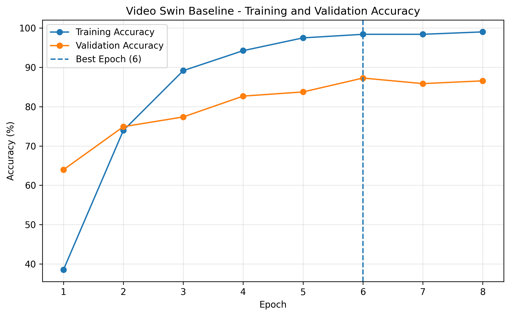
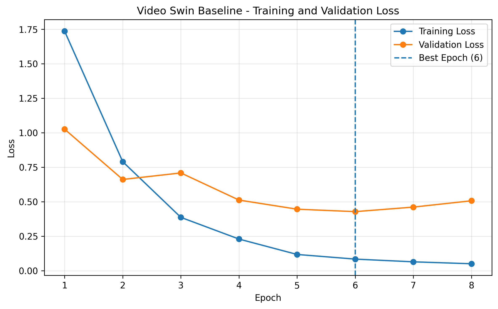
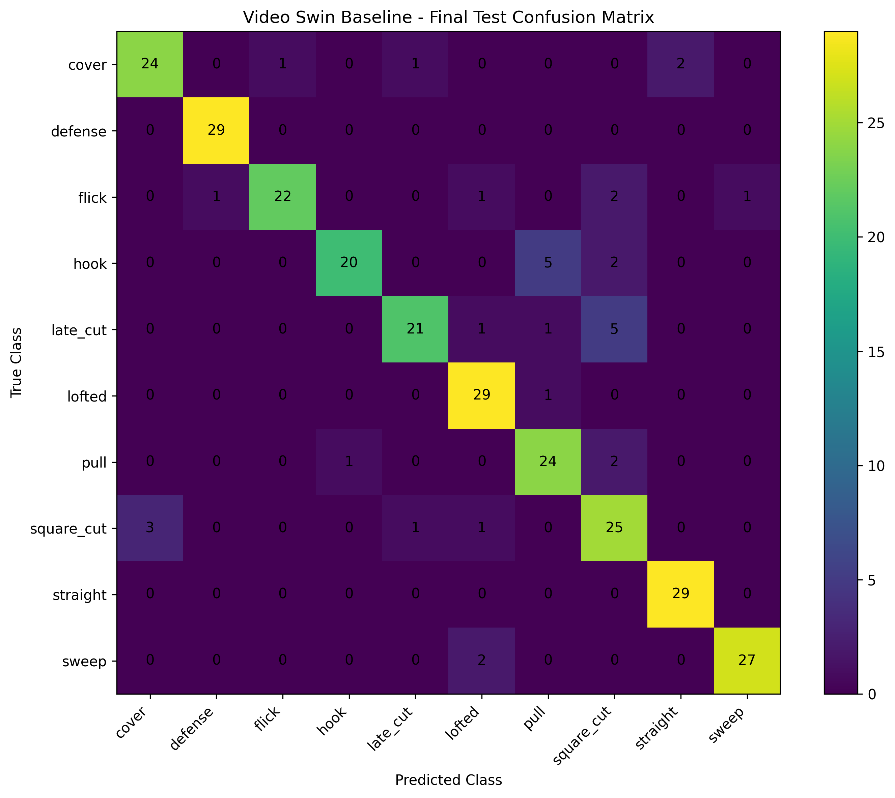
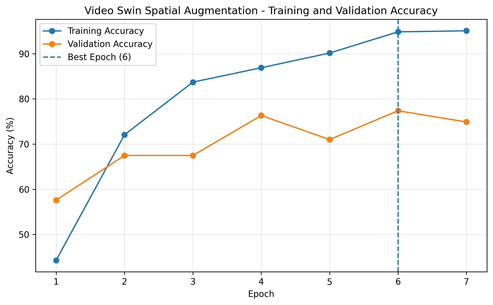
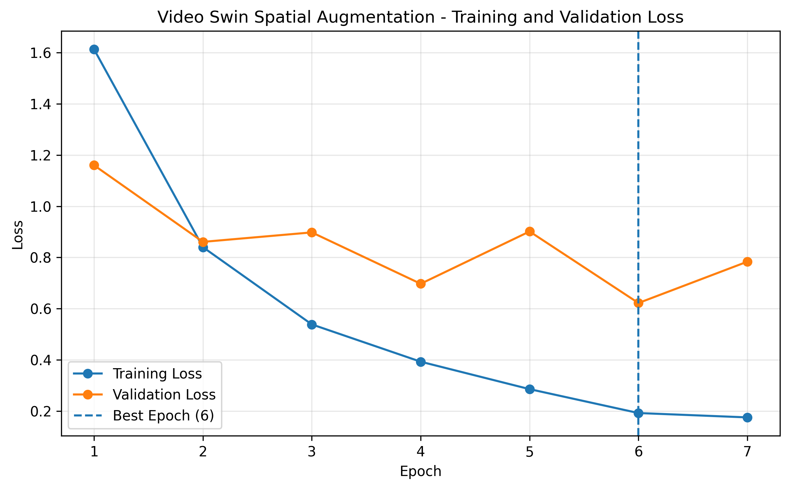
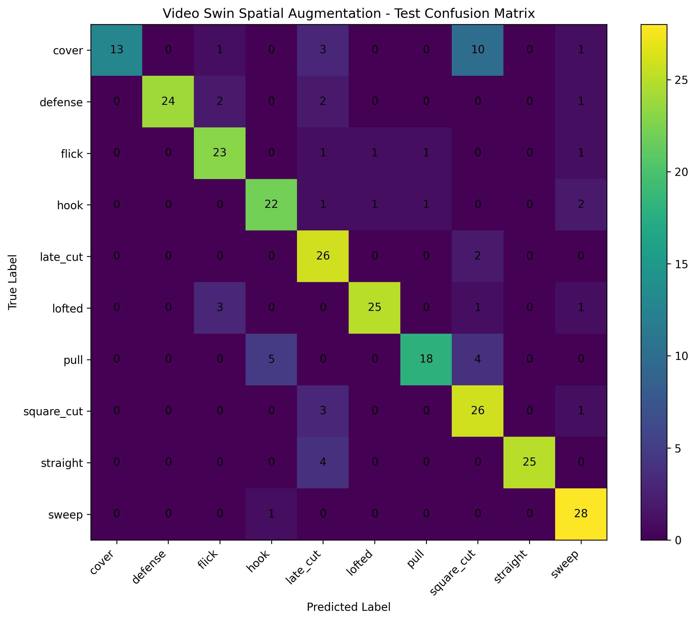

# Cricket Shot Classification using Video Swin Transformer

A deep learning project for classifying cricket batting shots from video clips using a pretrained **Video Swin Transformer (Swin3D-T)**.

This repository investigates different strategies for improving cricket shot classification, beginning with a baseline Video Swin Transformer and progressively evaluating spatial augmentation, temporal augmentation, and regularization.

---

## Project Overview

The objective of this project is to classify cricket batting videos into **10 shot categories** using a Video Swin Transformer.

Each experiment is maintained separately so that its effect on model performance can be evaluated clearly.

| Experiment | Description | Status |
|---|---|---|
| 01 | Video Swin Baseline | ✅ Completed |
| 02 | Spatial Augmentation | ✅ Completed |
| 03 | Temporal Augmentation | 🔄 To be added |
| 04 | Regularization | 🔄 To be added |

---

## Dataset

The dataset contains **1,888 cricket shot videos** belonging to 10 classes.

### Shot Classes

1. Cover
2. Defense
3. Flick
4. Hook
5. Late Cut
6. Lofted
7. Pull
8. Square Cut
9. Straight
10. Sweep

### Dataset Split

| Split | Videos |
|---|---:|
| Train | 1,321 |
| Validation | 283 |
| Test | 284 |
| **Total** | **1,888** |

The video dataset itself is not stored in this repository because of its size.

Expected dataset organization:

```text
dataset/
├── train/
│   ├── cover/
│   ├── defense/
│   ├── flick/
│   ├── hook/
│   ├── late_cut/
│   ├── lofted/
│   ├── pull/
│   ├── square_cut/
│   ├── straight/
│   └── sweep/
├── val/
└── test/
```

---

## Model Architecture

The experiments use **Swin3D-T** from Torchvision with pretrained **Kinetics-400** weights.

| Component | Configuration |
|---|---|
| Architecture | Swin3D-T |
| Pretrained Weights | Kinetics-400 |
| Number of Classes | 10 |
| Frames per Video | 32 |
| Input Resolution | 224 × 224 |
| Fine-tuning | Full model |
| Framework | PyTorch / Torchvision |

The original Kinetics-400 classification layer predicts 400 action classes. It is replaced with a new classification layer for the **10 cricket shot classes**.

---

## Video Preprocessing

Each video is converted into a fixed-length clip before being passed to the network.

```text
Input Video
    ↓
Read video frames
    ↓
Uniformly sample 32 frames
    ↓
Convert frames to tensor
    ↓
Resize / spatial processing
    ↓
224 × 224
    ↓
Normalize
    ↓
Video Tensor [C, T, H, W]
    ↓
[3, 32, 224, 224]
    ↓
Video Swin Transformer
```

Uniform temporal sampling converts videos with different frame counts into a consistent **32-frame representation**.

---

## Training Configuration

| Parameter | Value |
|---|---|
| Optimizer | AdamW |
| Loss Function | Cross Entropy Loss |
| Batch Size | 2 |
| Backbone Learning Rate | 1e-5 |
| Classification Head Learning Rate | 1e-4 |
| Weight Decay | 1e-4 |
| Mixed Precision | Enabled |
| Fine-tuning Strategy | Full fine-tuning |
| Pretraining Dataset | Kinetics-400 |

Differential learning rates are used during fine-tuning.

The pretrained Video Swin backbone uses a smaller learning rate, while the newly initialized classification head uses a larger learning rate.

---

# Experiment 01 — Baseline Video Swin

The baseline experiment uses deterministic preprocessing without custom spatial or temporal augmentation.

The model was trained for **8 epochs**.

## Baseline Training Results

| Epoch | Train Accuracy | Validation Accuracy | Train Loss | Validation Loss |
|---:|---:|---:|---:|---:|
| 1 | 38.53% | 63.96% | 1.7358 | 1.0256 |
| 2 | 73.96% | 74.91% | 0.7897 | 0.6610 |
| 3 | 89.17% | 77.39% | 0.3863 | 0.7084 |
| 4 | 94.25% | 82.69% | 0.2290 | 0.5118 |
| 5 | 97.50% | 83.75% | 0.1174 | 0.4456 |
| **6** | **98.41%** | **87.28%** | **0.0837** | **0.4279** |
| 7 | 98.41% | 85.87% | 0.0640 | 0.4607 |
| 8 | 99.02% | 86.57% | 0.0500 | 0.5066 |

The highest validation accuracy was obtained at **Epoch 6**, so the Epoch 6 checkpoint was selected for final testing.

## Baseline Test Results

| Metric | Result |
|---|---:|
| Best Epoch | **6** |
| Best Validation Accuracy | **87.28%** |
| Test Loss | **0.3554** |
| Test Accuracy | **88.03%** |
| Correct Predictions | **250 / 284** |
| Wrong Predictions | **34 / 284** |
| Macro F1 Score | **0.8798** |
| Weighted F1 Score | **0.8804** |

### Baseline Accuracy Curve



### Baseline Loss Curve



### Baseline Confusion Matrix



Detailed baseline metrics are available in:

```text
results/baseline/metrics.txt
```

---

# Experiment 02 — Spatial Augmentation

The second experiment introduces **training-only spatial augmentation** while keeping validation and test preprocessing deterministic.

The same randomly selected spatial transformation parameters are applied consistently across all **32 frames of a clip**, preserving temporal consistency.

## Spatial Augmentation Strategy

| Augmentation | Configuration |
|---|---|
| Random Resized Crop | Scale 0.80–1.00 |
| Horizontal Flip | Probability 0.5 |
| Brightness | ±0.15 |
| Contrast | ±0.15 |
| Saturation | ±0.10 |

The model was trained for **7 epochs**.

## Spatial Augmentation Training Results

| Epoch | Train Accuracy | Validation Accuracy | Train Loss | Validation Loss |
|---:|---:|---:|---:|---:|
| 1 | 44.28% | 57.60% | 1.6124 | 1.1599 |
| 2 | 72.07% | 67.49% | 0.8402 | 0.8609 |
| 3 | 83.72% | 67.49% | 0.5387 | 0.8979 |
| 4 | 86.90% | 76.33% | 0.3931 | 0.6973 |
| 5 | 90.16% | 71.02% | 0.2860 | 0.9015 |
| **6** | **94.85%** | **77.39%** | **0.1927** | **0.6222** |
| 7 | 95.08% | 74.91% | 0.1757 | 0.7836 |

The highest validation accuracy was obtained at **Epoch 6**, so the Epoch 6 checkpoint was selected for final testing.

## Spatial Augmentation Test Results

| Metric | Result |
|---|---:|
| Best Epoch | **6** |
| Best Validation Accuracy | **77.39%** |
| Test Loss | **0.5284** |
| Test Accuracy | **80.99%** |
| Correct Predictions | **230 / 284** |
| Wrong Predictions | **54 / 284** |
| Macro F1 Score | **0.8082** |
| Weighted F1 Score | **0.8092** |

### Spatial Augmentation Accuracy Curve



### Spatial Augmentation Loss Curve



### Spatial Augmentation Confusion Matrix



Detailed spatial augmentation metrics are available in:

```text
results/spatial_augmentation/metrics.txt
```

---

# Experiment Comparison

| Experiment | Best Epoch | Best Validation Accuracy | Test Accuracy | Macro F1 | Weighted F1 |
|---|---:|---:|---:|---:|---:|
| **Baseline** | 6 | **87.28%** | **88.03%** | **0.8798** | **0.8804** |
| Spatial Augmentation | 6 | 77.39% | 80.99% | 0.8082 | 0.8092 |
| Temporal Augmentation | — | — | — | — | — |
| Regularization | — | — | — | — | — |

## Current Observation

Spatial augmentation did **not improve performance over the baseline** in this experiment.

Compared with the baseline:

- Validation accuracy decreased from **87.28% → 77.39%**
- Test accuracy decreased from **88.03% → 80.99%**
- Macro F1 decreased from **0.8798 → 0.8082**

This result indicates that the selected spatial transformations and their current strengths did not provide a performance improvement for this dataset and training configuration.

The result is retained as part of the experimental study rather than discarded, allowing direct comparison with the upcoming temporal augmentation and regularization experiments.

---

## Repository Structure

```text
cricket-shot-classification-video-swin/
│
├── README.md
├── requirements.txt
├── .gitignore
│
├── notebooks/
│   ├── 01_video_swin_baseline.ipynb
│   ├── 02_video_swin_spatial_augmentation.ipynb
│   ├── 03_video_swin_temporal_augmentation.ipynb
│   └── 04_video_swin_regularization.ipynb
│
└── results/
    ├── baseline/
    │   ├── accuracy_curve.png
    │   ├── loss_curve.png
    │   ├── confusion_matrix.png
    │   └── metrics.txt
    │
    ├── spatial_augmentation/
    │   ├── accuracy_curve.png
    │   ├── loss_curve.png
    │   ├── confusion_matrix.png
    │   └── metrics.txt
    │
    ├── temporal_augmentation/
    └── regularization/
```

The temporal augmentation and regularization notebooks and their corresponding result files will be added progressively.

---

## Installation

Install the required Python packages using:

```bash
pip install -r requirements.txt
```

Main dependencies include:

- PyTorch
- Torchvision
- OpenCV
- NumPy
- Scikit-learn
- Matplotlib

---

## Hardware

The experiments were performed using an **NVIDIA Tesla T4 GPU** in Kaggle.

Automatic Mixed Precision (AMP) was used during training to reduce GPU memory usage and improve computational efficiency.

---

## Future Experiments

### Experiment 03 — Temporal Augmentation

The next experiment evaluates temporal augmentation strategies designed to introduce variation in the temporal sampling of cricket shot videos.

### Experiment 04 — Regularization

The final experiment evaluates regularization strategies designed to reduce overfitting and improve model generalization.

After all experiments are completed, their validation accuracy, test accuracy, F1 scores, training behavior, and class-wise performance will be compared.
