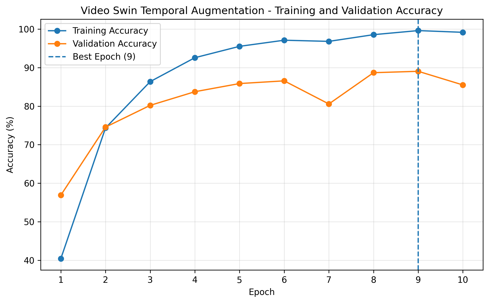
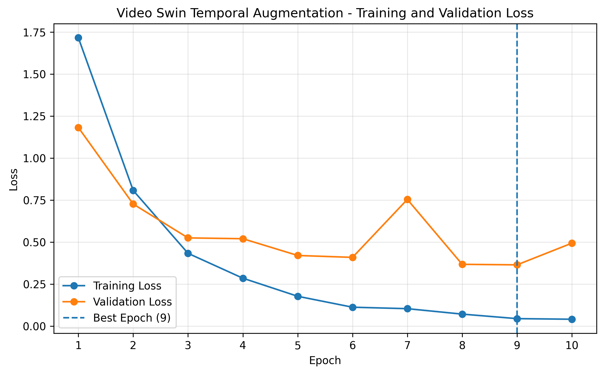
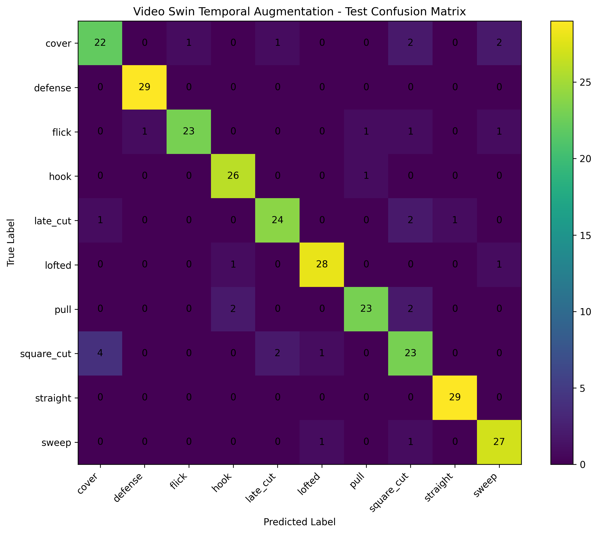
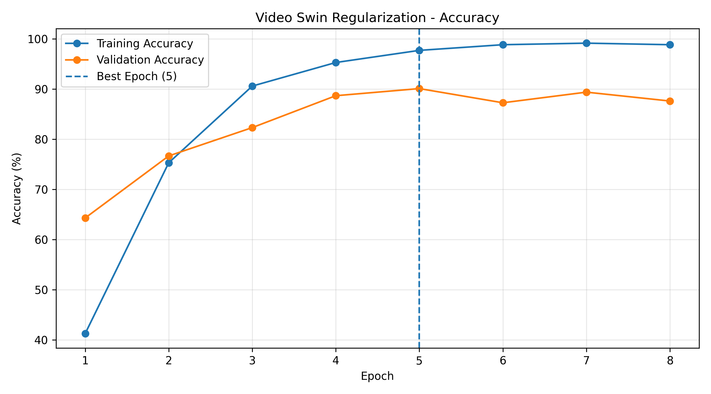
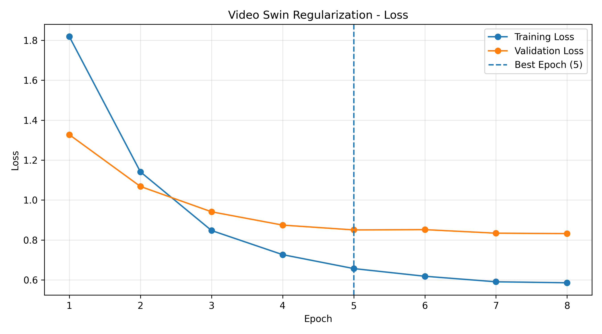
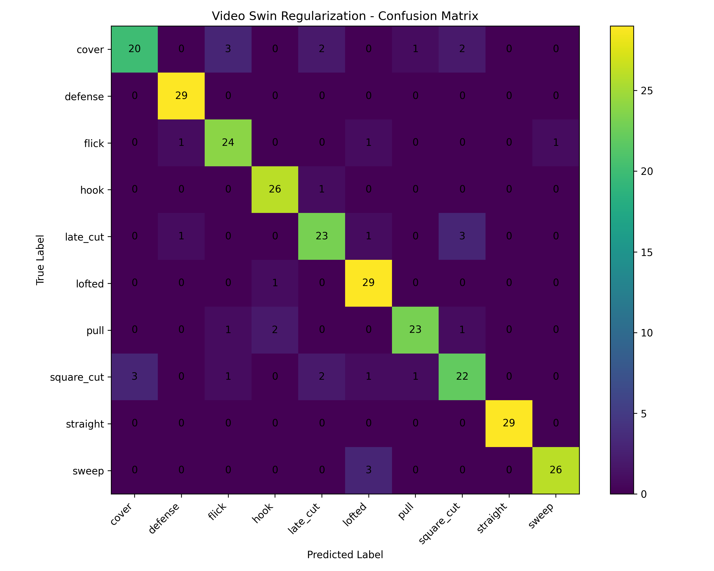

# Cricket Shot Classification using Video Swin Transformer

A deep learning project for classifying cricket batting shots from video clips using a pretrained **Video Swin Transformer (Swin3D-T)**.

This repository presents four experiments investigating the effects of spatial augmentation, temporal augmentation, and regularization on video-based cricket shot classification.

## Project Overview

The objective is to classify cricket batting videos into **10 shot categories** using a Video Swin Transformer pretrained on Kinetics-400.

| Experiment | Description | Status |
|---|---|---|
| 01 | Video Swin Baseline | Completed |
| 02 | Spatial Augmentation | Completed |
| 03 | Temporal Augmentation | Completed |
| 04 | Regularization | Completed |

---

## Dataset

The dataset contains **1,888 videos** belonging to 10 cricket shot classes.

**Classes:** Cover, Defense, Flick, Hook, Late Cut, Lofted, Pull, Square Cut, Straight, Sweep.

| Split | Videos |
|---|---:|
| Training | 1,321 |
| Validation | 283 |
| Testing | 284 |
| **Total** | **1,888** |

The dataset is not included in this repository due to its size.

### Expected Dataset Structure

```text
dataset/
├── train/
│   ├── cover/
│   ├── defense/
│   ├── flick/
│   ├── hook/
│   ├── late_cut/
│   ├── lofted/
│   ├── pull/
│   ├── square_cut/
│   ├── straight/
│   └── sweep/
├── val/
└── test/
```

---

## Model Architecture

The model is based on **Swin3D-T**, implemented using PyTorch and Torchvision.

| Component | Configuration |
|---|---|
| Architecture | Video Swin Transformer (Swin3D-T) |
| Pretrained Weights | Kinetics-400 |
| Input Frames | 32 |
| Input Resolution | 224 × 224 |
| Number of Classes | 10 |
| Fine-Tuning | Full model |

The pretrained classification head is replaced:

```text
Original Classification Head: Linear(768 → 400)
Modified Classification Head: Linear(768 → 10)
```

### Processing Pipeline

```text
Input Cricket Video
        ↓
Video Frame Extraction
        ↓
32-Frame Temporal Sampling
        ↓
Spatial Preprocessing
        ↓
Normalization
        ↓
Video Tensor [3, 32, 224, 224]
        ↓
Video Swin Transformer
        ↓
Classification Head
        ↓
Predicted Cricket Shot
```

---

## Training Configuration

| Parameter | Value |
|---|---|
| Optimizer | AdamW |
| Initial Backbone Learning Rate | 1e-5 |
| Initial Head Learning Rate | 1e-4 |
| Weight Decay | 1e-4 |
| Batch Size | 2 |
| Mixed Precision | Enabled |
| Pretraining Dataset | Kinetics-400 |

The baseline, spatial augmentation, and temporal augmentation experiments use cross-entropy loss. The regularization experiment introduces label smoothing.

---

# Experiment 01 — Baseline

The baseline experiment uses uniform temporal sampling and deterministic spatial preprocessing.

No custom augmentation is applied.

### Training Results

| Epoch | Train Accuracy | Validation Accuracy | Train Loss | Validation Loss |
|---:|---:|---:|---:|---:|
| 1 | 38.53% | 63.96% | 1.7358 | 1.0256 |
| 2 | 73.96% | 74.91% | 0.7897 | 0.6610 |
| 3 | 89.17% | 77.39% | 0.3863 | 0.7084 |
| 4 | 94.25% | 82.69% | 0.2290 | 0.5118 |
| 5 | 97.50% | 83.75% | 0.1174 | 0.4456 |
| **6** | **98.41%** | **87.28%** | **0.0837** | **0.4279** |
| 7 | 98.41% | 85.87% | 0.0640 | 0.4607 |
| 8 | 99.02% | 86.57% | 0.0500 | 0.5066 |

**Best checkpoint:** Epoch 6.

### Final Test Results

| Metric | Result |
|---|---:|
| Best Validation Accuracy | 87.28% |
| Test Loss | 0.3554 |
| Test Accuracy | **88.03%** |
| Correct Predictions | 250 / 284 |
| Macro F1 | 0.8798 |
| Weighted F1 | 0.8804 |

### Training Curves


### Confusion Matrix


Detailed results: `results/baseline/metrics.txt`

---

# Experiment 02 — Spatial Augmentation

This experiment introduces training-only spatial transformations.

The same transformation parameters are applied consistently across all frames in a clip.

### Augmentation Configuration

| Transformation | Configuration |
|---|---|
| Random Resized Crop | Scale 0.80–1.00 |
| Horizontal Flip | Probability 0.5 |
| Brightness Variation | ±0.15 |
| Contrast Variation | ±0.15 |
| Saturation Variation | ±0.10 |

Validation and test preprocessing remain deterministic.

### Training Results

| Epoch | Train Accuracy | Validation Accuracy | Train Loss | Validation Loss |
|---:|---:|---:|---:|---:|
| 1 | 44.28% | 57.60% | 1.6124 | 1.1599 |
| 2 | 72.07% | 67.49% | 0.8402 | 0.8609 |
| 3 | 83.72% | 67.49% | 0.5387 | 0.8979 |
| 4 | 86.90% | 76.33% | 0.3931 | 0.6973 |
| 5 | 90.16% | 71.02% | 0.2860 | 0.9015 |
| **6** | **94.85%** | **77.39%** | **0.1927** | **0.6222** |
| 7 | 95.08% | 74.91% | 0.1757 | 0.7836 |

**Best checkpoint:** Epoch 6.

### Final Test Results

| Metric | Result |
|---|---:|
| Best Validation Accuracy | 77.39% |
| Test Loss | 0.5284 |
| Test Accuracy | **80.99%** |
| Correct Predictions | 230 / 284 |
| Macro F1 | 0.8082 |
| Weighted F1 | 0.8092 |

### Training Curves


### Confusion Matrix


Detailed results: `results/spatial_augmentation/metrics.txt`

---

# Experiment 03 — Temporal Augmentation

This experiment introduces randomized temporal sampling during training.

Each video timeline is divided into **32 temporal segments**, and one frame is randomly selected from each segment.

The selected frames remain in chronological order.

### Temporal Sampling Pipeline

```text
Complete Video
       ↓
Divide Timeline into 32 Segments
       ↓
Randomly Select One Frame per Segment
       ↓
Preserve Chronological Order
       ↓
32-Frame Video Clip
       ↓
Video Swin Transformer
```

Validation and test videos use deterministic uniform sampling.

### Training Results

| Epoch | Train Accuracy | Validation Accuracy | Train Loss | Validation Loss |
|---:|---:|---:|---:|---:|
| 1 | 40.42% | 56.89% | 1.7163 | 1.1819 |
| 2 | 74.34% | 74.56% | 0.8072 | 0.7263 |
| 3 | 86.37% | 80.21% | 0.4328 | 0.5246 |
| 4 | 92.58% | 83.75% | 0.2847 | 0.5198 |
| 5 | 95.53% | 85.87% | 0.1771 | 0.4200 |
| 6 | 97.12% | 86.57% | 0.1120 | 0.4087 |
| 7 | 96.82% | 80.57% | 0.1033 | 0.7537 |
| 8 | 98.56% | 88.69% | 0.0709 | 0.3673 |
| **9** | **99.62%** | **89.05%** | **0.0440** | **0.3642** |
| 10 | 99.17% | 85.51% | 0.0404 | 0.4932 |

Learning rates were reduced before Epoch 8.

**Best checkpoint:** Epoch 9.

### Final Test Results

| Metric | Result |
|---|---:|
| Best Validation Accuracy | 89.05% |
| Test Loss | 0.3736 |
| Test Accuracy | **89.44%** |
| Correct Predictions | 254 / 284 |
| Macro F1 | 0.8941 |
| Weighted F1 | 0.8940 |

### Training Curves





### Confusion Matrix



Detailed results: `results/temporal_augmentation/metrics.txt`

---

# Experiment 04 — Regularization

The regularization experiment introduces **label smoothing** into the cross-entropy loss function.

### Regularization Configuration

| Parameter | Value |
|---|---|
| Loss Function | Cross Entropy |
| Label Smoothing | 0.1 |
| Optimizer | AdamW |
| Weight Decay | 1e-4 |
| Input Frames | 32 |
| Input Resolution | 224 × 224 |

Label smoothing reduces the confidence assigned to the target class during training, discouraging overly confident predictions.

The experiment was trained for **8 epochs**, with the best validation accuracy achieved at Epoch 5.

### Training Results

| Epoch | Train Accuracy | Validation Accuracy | Train Loss | Validation Loss |
|---:|---:|---:|---:|---:|
| 1 | 41.26% | 64.31% | 1.8182 | 1.3273 |
| 2 | 75.32% | 76.68% | 1.1411 | 1.0681 |
| 3 | 90.61% | 82.33% | 0.8476 | 0.9413 |
| 4 | 95.31% | 88.69% | 0.7267 | 0.8747 |
| **5** | **97.73%** | **90.11%** | **0.6570** | **0.8506** |
| 6 | 98.86% | 87.28% | 0.6186 | 0.8520 |
| 7 | 99.17% | 89.40% | 0.5909 | 0.8343 |
| 8 | 98.86% | 87.63% | 0.5860 | 0.8321 |

**Best checkpoint:** Epoch 5.

### Final Test Results

| Metric | Result |
|---|---:|
| Best Validation Accuracy | **90.11%** |
| Test Loss | 0.4258 |
| Test Accuracy | **88.38%** |
| Correct Predictions | 251 / 284 |
| Incorrect Predictions | 33 |
| Macro F1 | 0.8822 |
| Weighted F1 | 0.8822 |

### Training Curves





### Confusion Matrix



Detailed results: `results/regularization/metrics.txt`

---

# Final Experiment Comparison

| Experiment | Best Epoch | Best Validation Accuracy | Test Accuracy | Macro F1 | Weighted F1 |
|---|---:|---:|---:|---:|---:|
| Baseline | 6 | 87.28% | 88.03% | 0.8798 | 0.8804 |
| Spatial Augmentation | 6 | 77.39% | 80.99% | 0.8082 | 0.8092 |
| **Temporal Augmentation** | 9 | 89.05% | **89.44%** | **0.8941** | **0.8940** |
| Regularization | 5 | **90.11%** | 88.38% | 0.8822 | 0.8822 |

## Key Findings

**1. Baseline Performance**

The baseline achieved 88.03% test accuracy, establishing a strong reference for evaluating subsequent modifications.

**2. Spatial Augmentation**

Spatial augmentation reduced test accuracy from 88.03% to 80.99%, indicating that the selected augmentation configuration did not improve performance.

**3. Temporal Augmentation**

Temporal augmentation achieved the highest test accuracy of **89.44%**, improving over the baseline by **1.41 percentage points**.

**4. Regularization**

Label smoothing achieved the highest validation accuracy of **90.11%**, but its test accuracy of 88.38% remained below the temporal augmentation result.

## Overall Conclusion

Among the four experiments, **temporal augmentation produced the strongest test-set performance**.

Regularization achieved the highest validation accuracy, while spatial augmentation reduced performance relative to the baseline.

These findings highlight the importance of evaluating individual training modifications rather than assuming that additional augmentation or regularization will always improve classification accuracy.

---

# Repository Structure

```text
cricket-shot-classification-video-swin/
├── README.md
├── requirements.txt
├── .gitignore
├── notebooks/
│   ├── 01_video_swin_baseline.ipynb
│   ├── 02_video_swin_spatial_augmentation.ipynb
│   ├── 03_video_swin_temporal_augmentation.ipynb
│   └── 04_video_swin_regularization.ipynb
└── results/
    ├── baseline/
    │   ├── accuracy_curve.png
    │   ├── loss_curve.png
    │   ├── confusion_matrix.png
    │   └── metrics.txt
    ├── spatial_augmentation/
    │   ├── accuracy_curve.png
    │   ├── loss_curve.png
    │   ├── confusion_matrix.png
    │   └── metrics.txt
    ├── temporal_augmentation/
    │   ├── accuracy_curve.png
    │   ├── loss_curve.png
    │   ├── confusion_matrix.png
    │   └── metrics.txt
    └── regularization/
        ├── accuracy_curve.png
        ├── loss_curve.png
        ├── confusion_matrix.png
        └── metrics.txt
```

---

# Installation

Install the required Python dependencies:

```bash
pip install -r requirements.txt
```

Main libraries:

- PyTorch
- Torchvision
- OpenCV
- NumPy
- Scikit-learn
- Matplotlib

---

# Hardware

The experiments were performed using an **NVIDIA Tesla T4 GPU** in Kaggle.

Automatic Mixed Precision (AMP) was used during training.

---

# Future Work

Potential extensions include:

- Combining temporal augmentation with label smoothing.
- Evaluating additional temporal sampling strategies.
- Performing ablation studies on augmentation strengths.
- Investigating generalization to unseen cricket videos.
- Building a video-upload interface for cricket shot prediction.

---

# Final Summary

**Best Test Model:** Video Swin Transformer with Temporal Augmentation

**Best Test Accuracy:** 89.44%

**Best Validation Accuracy:** 90.11% (Regularization Experiment)

**Number of Classes:** 10

**Total Videos:** 1,888

